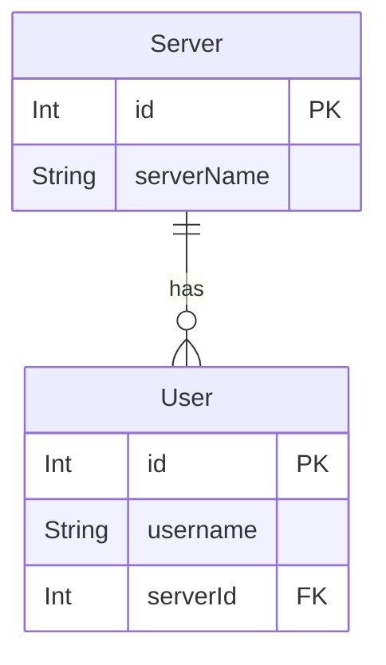
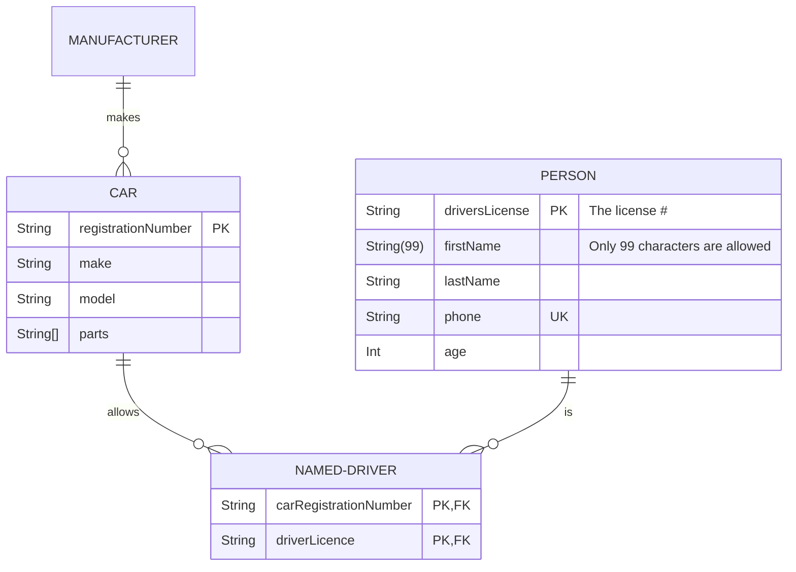
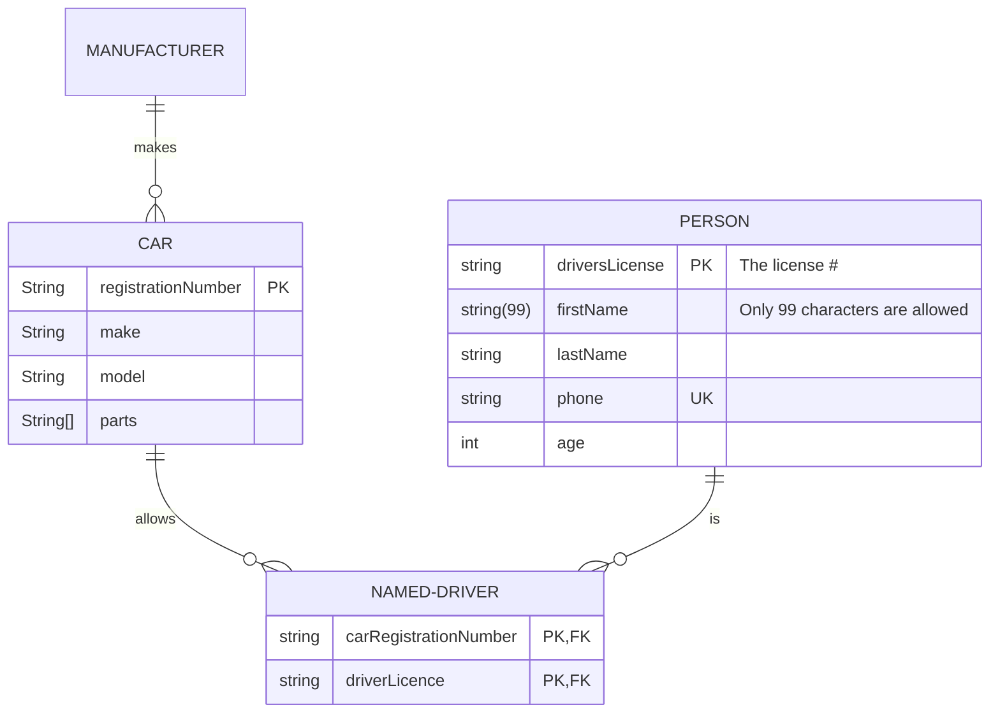

```mermaid
erDiagram
    User {
        Int id PK
        String username
        Int serverId FK
    }

    Server {
        Int id PK
        String serverName
    }

    Server ||--o{ User : has
```

```mermaid
erDiagram
    CAR ||--o{ NAMED-DRIVER : allows
    CAR {
        String registrationNumber PK
        String make
        String model
        String[] parts
    }
    PERSON ||--o{ NAMED-DRIVER : is
    PERSON {
        String driversLicense PK "The license #"
        String(99) firstName "Only 99 characters are allowed"
        String lastName
        String phone UK
        Int age
    }
    NAMED-DRIVER {
        String carRegistrationNumber PK, FK
        String driverLicence PK, FK
    }
    MANUFACTURER only one to zero or more CAR : makes

```

```mermaid
erDiagram
    CAR ||--o{ NAMED-DRIVER : allows
    CAR {
        string registrationNumber PK
        string make
        string model
        string[] parts
    }
    PERSON ||--o{ NAMED-DRIVER : is
    PERSON {
        string driversLicense PK "The license #"
        string(99) firstName "Only 99 characters are allowed"
        string lastName
        string phone UK
        int age
    }
    NAMED-DRIVER {
        string carRegistrationNumber PK, FK
        string driverLicence PK, FK
    }
    MANUFACTURER only one to zero or more CAR : makes

```

### Broken

```mermaid
erDiagram
    CAR ||--o{ NAMED-DRIVER : allows
    CAR {
        String registrationNumber PK
        String make
        String model
        String[] parts
    }
    PERSON ||--o{ NAMED-DRIVER : is
    PERSON {
        string driversLicense PK "The license #"
        string(99) firstName "Only 99 characters are allowed"
        string lastName
        string phone UK
        int age
    }
    NAMED-DRIVER {
        string carRegistrationNumber PK, FK
        string driverLicence PK, FK
    }
    MANUFACTURER only one to zero or more CAR : makes

```
